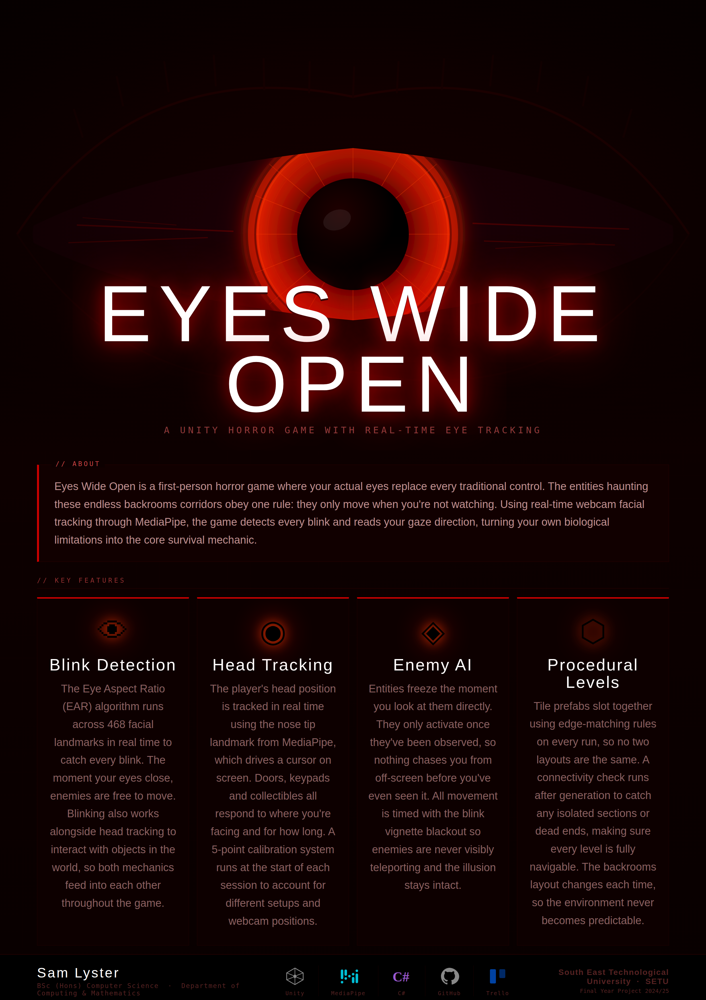

# Eyes Wide Open

A first-person horror game built in Unity where real-time eye and head tracking replace traditional inputs. A standard webcam watches the player, and every gameplay system is driven by where you're looking and when you blink.

Final Year Project — BSc (Hons) Computer Science, South East Technological University (SETU), 2026.
Developed by Sam Lyster Cummins.

## Concept

The game uses Google's MediaPipe face-mesh model to track 468 facial landmarks every frame through a standard webcam. Those landmarks drive two things:

- A head-tracked gaze cursor used to aim at objects and interact with the world.
- A blink detector that recognises when the player closes their eyes in the real world.

Blinking isn't just a confirmation input. It's the main threat mechanic in the game. The enemies in the game can only move when you're not looking at them, so every real-world blink is a window for them to get closer.

## Gameplay

The game is four floors deep. On each floor the player:

1. Explores a procedurally generated dungeon.
2. Finds four hidden code digits.
3. Enters them at a keypad to unlock the stairs down.

After reaching the bottom floor the player triggers a detonation sequence and has to climb back up through all four floors to escape before the timer runs out.

Every interaction follows the same pattern: aim with the head cursor, confirm with a blink.

## Features

- **Real-time eye and head tracking** via MediaPipe over a local Python-to-Unity socket.
- **Blink detection** using the Eye Aspect Ratio algorithm with multi-frame confirmation.
- **Nine-point gaze calibration** that runs at the start of the game, with a recalibration button in the pause menu.
- **Two enemy types**:
  - *Anomalies* — can only move while you're not looking at them. Teleport along a NavMesh path during blinks.
  - *Pacers* — patrol with line-of-sight checks and chase the player on sight. Ignore the gaze-freeze rule.
- **Procedural dungeon generation** using an edge-compatibility tile system and a breadth-first flood fill to guarantee reachability.
- **Siren phases** triggered on code pickups, temporarily disabling the gaze-freeze rule so enemies can move freely.
- **Flashlight and battery system** with per-level drain scaling. Used to stun Pacers and push Anomalies away.
- **Goggles** toggled with a double blink, used to reveal hidden rooms.
- **Insanity system** that builds up in the dark or near enemies and affects the screen, audio, and flashlight stability.
- **Locker hiding** that breaks enemy line-of-sight and observation during siren phases.
- **Intro scene** with a silent character and cassette tapes that teach the mechanics in-world, no text tutorial.
- **Save system** with slots, settings, and a full main menu.

## Controls

| Input | Action |
|-------|--------|
| Head movement | Aim the gaze cursor |
| Blink | Confirm / interact |
| Double blink | Toggle goggles (after pickup) |
| W / A / S / D | Move |
| Shift | Sprint |
| F | Toggle flashlight |
| M | Pause menu |

## Requirements

- Windows PC
- Webcam (standard laptop or USB webcam is fine)
- Reasonably lit environment for tracking to work well

## Built With

- Unity (C#) — game engine and all gameplay systems.
- MediaPipe Unity Plugin — handles the webcam landmark extraction.
- A local socket between Python and Unity carries the tracking data each frame.

Every gameplay system, the blink detector, the gaze mapping, the calibration flow, the procedural generator, both enemy AIs, the insanity system, and every interactive object, is built in C# for this project.

## Project Structure

```
Assets/
├── Scripts/           Core gameplay scripts
├── Scenes/            Main menu, intro, and dungeon scenes
├── Prefabs/           Tile prefabs, enemies, items
├── Models/            3D models
├── Materials/         Shaders and materials
└── Audio/             Music, ambient, and sound effects
```
